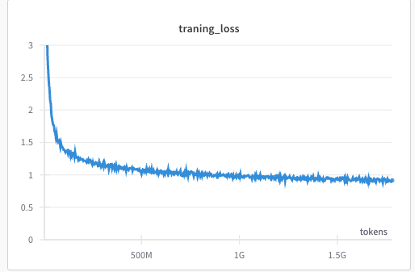

# Ohara

This is my collection of implimention of llm,paper and things I hand in my mind
I hand lot of fragmented code of implimention of diffrent model 

this is attempt to make it eveything in one place <br>
This lib is for runing/copying code for expriments


```bash
## download and pretokenize
python examples/prepare-dataset.py

## train 
## look at train.py its fairly easy
python examples/train_llama.py

# lighting fabric verison is also avalible (recommanded)
python examples/train_llama_fabric.py 
```


llama-20M trained on tinystores for 1.7B

inferance on phi2
```zsh
## this will download model from hf and run it in torch.flaot16

python phi_inference.py 

## look at files and you can impliment rest of things easily, 
## I belive in you 😉
```


###  The lib to maximize FAFO
papaers and theory is on one side but `code is truth`, in the end things that matter that works (runs)<br>
If you look into [docs](./docs/) you can find some written things. this are mostly copied from my obsidian notes


### WORK IS PROGESS (always)

### papers
1. [SwiGLU](./ohara/models/mlp.py) | [md](./docs/glu/GLU%20Variants%20Improve%20Transformer.md)
    - 
2. [Alibi Embeddings](./ohara/embedings_pos/alibi.py) | [md](./ohara/embedings_pos/alibi/alibi.md)
    - 
3. [Rotary Embeddings](./ohara/embedings_pos/rotatry.py) | [md](./docs/RoFormer.md) 
    - 
4. [LoRA ](./ohara/adaptor/lora.py)
    - 
5. [LLAMA](./ohara/llama/llama.py) | [md](./docs/llama/llama.md)
6. [XPOS](./ohara/embedings_pos/xpos.py)
7. [GPT](./ohara/models/gpt.py) | [md](./docs/gpt/gpt.md)
8. [Mamba](./ohara/models/mamba.py)
9. [renet](./ohara/models/retnet.py)


### More things are not in this repo
1. [TinyLora](https://github.com/joey00072/TinyLora)
2. [Neural Style Transfer in Pytorch](https://github.com/joey00072/Neural-Style-Transfer-in-Pytorch)


## TODO  (A lot)
- [ ] make infercer class better
- [ ] make training loop better (use lightning fabric maybe)
- [ ] Finetuning in structed way (I just rawdoag code when I need it)
- [ ] DPO 
- [ ] make is py modele so I can create expriment folder and put all this in it

## Fund My Caffeine Addiction 
[](https://ko-fi.com/R6R8KQTZ5)


### contribution guidelines
- be nice, 
- code explaintions || docs are appricated
- memes on pr recommend

