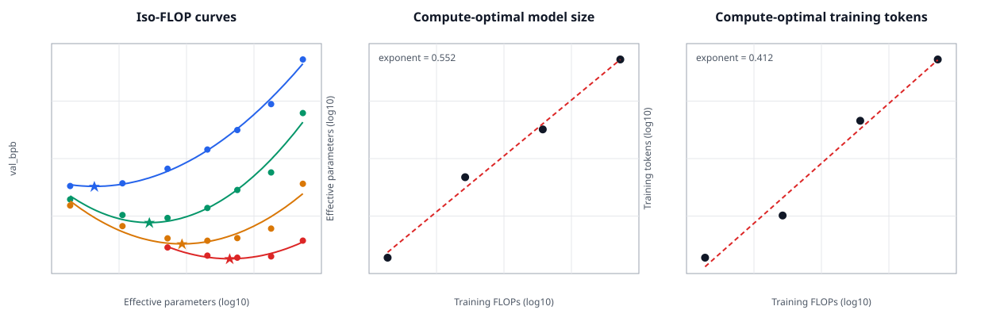

# Ohara

This is my collection of implementations of LLMs, papers, and things I have in my mind.
I had a lot of fragmented code implementing different models — this is an attempt to keep
everything in one place.

This lib is for running/copying code for experiments.

## Install

```bash
git clone https://github.com/joey00072/ohara.git
cd ohara
uv sync
uv run python examples/train_llama_engine.py
```

## What is where

| Path | What is in it |
| --- | --- |
| [`ohara/models/`](./ohara/models/) | Standalone model implementations (llama, gpt, phi, gemma, mamba, roformer, retnet) |
| [`ohara/modules/`](./ohara/modules/) | Shared blocks: attention, MLP/GLU variants, MoE, norms, KV cache |
| [`ohara/embeddings_pos/`](./ohara/embeddings_pos/) | Position embeddings: rotary, alibi, xpos |
| [`ohara/runtime/`](./ohara/runtime/) | `OharaEngine`: device placement, precision, DDP, tensor parallel |
| [`ohara/trainer.py`](./ohara/trainer.py) | The training loop (eval, checkpoints, MFU, bpb) |
| [`ohara/optimizer.py`](./ohara/optimizer.py) | AdamW, Muon, and the constant-norm AdamH / MuonH |
| [`ohara/scaling.py`](./ohara/scaling.py) | iso-FLOP sweep planning and curve fitting |
| [`ohara/chat.py`](./ohara/chat.py) | Conversation special tokens, rendering, assistant-only loss masks |
| [`ohara/sft.py`](./ohara/sft.py) | SFT conversation sources and best-fit packing |
| [`ohara/chat_engine.py`](./ohara/chat_engine.py) | Streaming chat inference over a finetuned checkpoint |
| [`ohara/webui/`](./ohara/webui/) | Browser chat UI (standard library only, no web framework) |
| [`examples/`](./examples/) | Runnable entrypoints: pretokenize, train, eval, scaling sweeps |
| [`experiments/`](./experiments/) | Frozen per-paper snapshots. Copy a folder and hack on it |
| [`docs/notes/`](./docs/notes/) | Notes, mostly copied from my obsidian vault |

Most-used bits are re-exported at the top level:

```python
from ohara import Llama, Config, Trainer, OharaEngine
```

## Train a chat model and talk to it

The nanochat pipeline — pretrain, finetune, chat — on ohara's stack. One script,
one dial (`DEPTH`); width, batch size, learning rates, weight decay and the token
horizon are all derived from it by [`ohara/scaling.py`](./ohara/scaling.py).

```bash
DEPTH=12 bash runs/speedrun.sh          # data -> pretrain -> SFT -> web UI
```

It takes hours, so run it detached: `screen -L -Logfile runs/speedrun.log -S speedrun bash runs/speedrun.sh`.
The stages are ordinary scripts, so you can also run them one at a time:

```bash
# 1. pretrain on raw text, reserving the conversation tokens in the vocabulary
python examples/train_llama_engine.py --dataset ./data/scaling_corpus --chat-tokens ...

# 2. finetune on SmolTalk + MMLU + GSM8K, supervising only assistant tokens
python examples/train_sft.py --pretrained-checkpoint ./ckpt/base_d12.pt

# 3. chat with it in the browser
python examples/chat_web.py --checkpoint ./ckpt/sft_d12.pt
```

Then open <http://localhost:8080>. When the model lives on a remote box, forward the
port instead of binding it publicly: `ssh -N -L 8080:localhost:8080 <user>@<host>`.

The web UI streams tokens over server-sent events and exposes temperature, top-p,
top-k and a token budget. It is built on `http.server`, so serving the model adds
no dependencies to a training box.

**Conversation format.** Messages are wrapped in the same special tokens nanochat
uses (`<|user_start|>`, `<|assistant_start|>`, and a `<|python_start|>` /
`<|output_start|>` pair for tool calls). Loss is taken only on tokens the assistant
should *produce* — including the closing `<|assistant_end|>`, so the model learns to
stop — and never on user turns or on interpreter output the model only reads back:

```python
from ohara import load_chat_tokenizer, render_conversation

tokenizer = load_chat_tokenizer(hf_name="EleutherAI/gpt-neo-125m")
ids, mask = render_conversation(tokenizer, [
    {"role": "user", "content": "why is the sky blue?"},
    {"role": "assistant", "content": "rayleigh scattering."},
])  # mask[i] == 1 marks a supervised token
```

SFT rows are packed best-fit from a lookahead buffer: each row starts at a
conversation boundary, and leftover space is padded rather than filled with half a
conversation, so no conversation is ever split across rows.

## ClimbMix scaling laws

A 26-run nanochat-style iso-FLOP sweep on NanoChat's ClimbMix corpus: depths 2–8 (7.0M–53.0M
effective parameters) across four compute budgets (1e16 – 8e16 FLOPs), 5.86B training tokens
total on 2x A100-80GB. All four budgets produced interior iso-FLOP minima.



| Budget | Optimal params | Optimal tokens | Tokens/param | val bpb |
| --- | --- | --- | --- | --- |
| 1e16 | 8.6M | 159M | 18.5 | 1.3296 |
| 2e16 | 13.9M | 190M | 13.7 | 1.2052 |
| 4e16 | 18.5M | 281M | 15.2 | 1.1321 |
| 8e16 | 28.0M | 362M | 12.9 | 1.0810 |

Fitted compute exponents, `N_opt ~ C^a` and `D_opt ~ C^b`:

| Fit | a (params) | b (tokens) |
| --- | --- | --- |
| All sampled depths (what `scaling_laws.py analyze` reports) | 0.552 | 0.412 |
| Local window, +/-2 depths around each curve's own minimum | 0.606 | 0.354 |
| Local window, +/-3 depths | 0.598 | 0.358 |

**Read the exponents as `a ~ 0.55-0.61`, not as three significant figures.** A single quadratic
fitted across the whole depth grid is not a good model of an iso-FLOP curve: the deep end
(d7-d8) is severely undertrained and rises steeply, which drags the fitted vertex left. Varying
the depth window moves `a` over 0.32-0.78 while `r^2` stays above 0.98 in every case, so **`r^2`
here is not evidence that the exponent is pinned down.** Restricting each curve to a consistent
window around its own minimum is the more defensible reading and is stable at `a ~ 0.60`.
The per-budget optima are much better determined than the exponent (+/-11% at 8e16, +/-14% at
2e16, +/-37% at 1e16, whose minimum sits at the small-model edge of the grid).

Against the TinyStories pilot below (`a = 0.656`, `b = 0.298`), ClimbMix is consistently more
token-hungry: 13-18 tokens per parameter at the optimum versus 7-11.6, and a larger token
exponent under every fitting method tried. That direction is robust even though the precise
exponent is not.

Reproduce with `examples/prepare_scaling_data.py` (stages ClimbMix shards by default) then
`examples/scaling_laws.py run` / `analyze`; raw results are in
[`scaling_results/climbmix_full/`](./scaling_results/climbmix_full/).

## TinyStories scaling pilot

A 15-run sweep across 13M–49M parameter models produced interior minima at all three compute
budgets, with exponents 0.656 for optimal model size and 0.298 for training tokens. This
validated the workflow on one A100; the values are specific to TinyStories.


llama-20M trained on tinystories for 1.7B tokens.

Inference on phi-2:

```bash
## this will download the model from hf and run it in torch.float16
uv run python examples/phi_inference.py --prompt "Once upon a time"

## look at the files and you can implement the rest of things easily,
## I believe in you 😉
```

See [docs/pretrain.md](./docs/pretrain.md) for the pretraining walkthrough.

### The lib to maximize FAFO

Papers and theory are on one side but `code is truth`; in the end what matters is the things that
work (run). If you look into [docs](./docs/) you can find some written things, mostly copied from my
obsidian notes.

### WORK IN PROGRESS (always)

### papers / models

- [Muon](./ohara/optimizer.py) | [modded-nanogpt](https://github.com/KellerJordan/Muon)
- [MuonH & AdamH](./ohara/optimizer.py) — constant-norm training, no weight decay | [paper](https://arxiv.org/abs/2603.28743)
- [TokenFormer](./experiments/tokenformer/pattention.py)
- [MLA](./experiments/MLA/mla.py)
- [Griffin & Hawk](./experiments/griffin_and_hawk/griffin_and_hawk.py)
- [Galore](./experiments/galore/galore.py)
- [Q-Sparse](./experiments/q_sparse/q_sparse.py)
- [Bitnet](./experiments/bitnet/bitnet.py) | [md](./experiments/bitnet/bitnet.md)
- [RetNet](./ohara/models/retnet.py)
- [Mixture of Depth](./experiments/mixture_of_depth/mixture_of_depth.py) | [md](./experiments/mixture_of_depth/md/building_mixture_of_depth.md)
- [Alibi Embeddings](./ohara/embeddings_pos/alibi.py) | [md](./docs/notes/alibi/alibi.md)
- [Rotary Embeddings](./ohara/embeddings_pos/rotary.py) | [md](./docs/notes/rope/RoFormer.md)
- [XPOS](./ohara/embeddings_pos/xpos.py)
- [LoRA](./ohara/adaptor/lora.py) | [md](./docs/notes/lora/lora.md)
- [DoRA](./ohara/adaptor/dora.py) | [paper](https://arxiv.org/abs/2402.09353)
- [LLAMA](./ohara/models/llama.py) | [md](./docs/notes/llama/llama.md)
- [Mamba](./ohara/models/mamba.py)
- [GPT](./ohara/models/gpt.py) | [md](./docs/notes/gpt/gpt.md)
- [GLU variants](./ohara/modules/mlp.py) | [md](<./docs/notes/glu/GLU Variants Improve Transformer.md>)

### More things are not in this repo

1. [TinyLora](https://github.com/joey00072/TinyLora)
2. [Neural Style Transfer in Pytorch](https://github.com/joey00072/Neural-Style-Transfer-in-Pytorch)

## Development

```bash
uv run pytest          # tests
uv run ruff check .    # lint (experiments/ is excluded on purpose)
```

## TODO (A lot)

- [ ] make inferencer class better
- [ ] finetuning in a structured way (I just rawdog code when I need it)
- [ ] KV cache for gemma
- [ ] recurrent + chunked forms for retnet
- [ ] more/faster MoE variants
- [ ] jagged cosine LR schedule for ReLoRA

## Fund My Caffeine Addiction

[](https://ko-fi.com/R6R8KQTZ5)

### contribution guidelines

- be nice,
- code explanations || docs are appreciated
- memes on pr recommend
