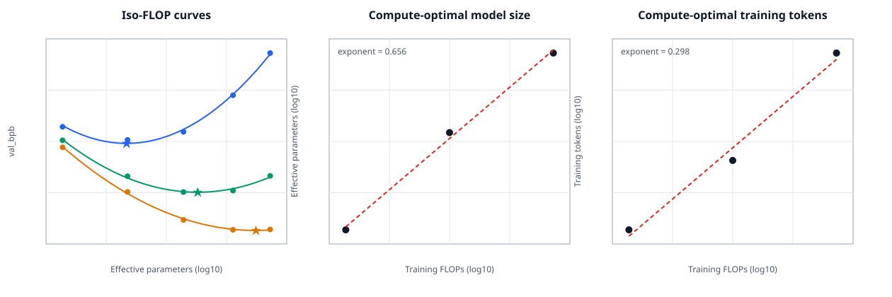

# Ohara

This is my collection of implementations of LLMs, papers, and things I have in my mind.
I had a lot of fragmented code implementing different models — this is an attempt to keep
everything in one place.

This lib is for running/copying code for experiments.

## Install

```bash
git clone https://github.com/joey00072/ohara.git
cd ohara
uv sync
uv run python examples/train_llama_engine.py
```

## What is where

| Path | What is in it |
| --- | --- |
| [`ohara/models/`](./ohara/models/) | Standalone model implementations (llama, gpt, phi, gemma, mamba, roformer, retnet) |
| [`ohara/modules/`](./ohara/modules/) | Shared blocks: attention, MLP/GLU variants, MoE, norms, KV cache |
| [`ohara/embeddings_pos/`](./ohara/embeddings_pos/) | Position embeddings: rotary, alibi, xpos |
| [`ohara/runtime/`](./ohara/runtime/) | `OharaEngine`: device placement, precision, DDP, tensor parallel |
| [`ohara/trainer.py`](./ohara/trainer.py) | The training loop (eval, checkpoints, MFU, bpb) |
| [`ohara/scaling.py`](./ohara/scaling.py) | iso-FLOP sweep planning and curve fitting |
| [`examples/`](./examples/) | Runnable entrypoints: pretokenize, train, eval, scaling sweeps |
| [`experiments/`](./experiments/) | Frozen per-paper snapshots. Copy a folder and hack on it |
| [`docs/notes/`](./docs/notes/) | Notes, mostly copied from my obsidian vault |

Most-used bits are re-exported at the top level:

```python
from ohara import Llama, Config, Trainer, OharaEngine
```

## TinyStories scaling pilot

A 15-run nanochat-style iso-FLOP sweep across 13M–49M parameter models produced interior minima at
all three compute budgets. The fitted compute exponents were 0.656 for optimal model size and 0.298
for training tokens. This validates the workflow on one A100; the values are specific to TinyStories
and are not directly comparable to NanoChat's ClimbMix results.
New scaling corpora are staged from NanoChat's ClimbMix shards by default.



llama-20M trained on tinystories for 1.7B tokens.

Inference on phi-2:

```bash
## this will download the model from hf and run it in torch.float16
uv run python examples/phi_inference.py --prompt "Once upon a time"

## look at the files and you can implement the rest of things easily,
## I believe in you 😉
```

See [docs/pretrain.md](./docs/pretrain.md) for the pretraining walkthrough.

### The lib to maximize FAFO

Papers and theory are on one side but `code is truth`; in the end what matters is the things that
work (run). If you look into [docs](./docs/) you can find some written things, mostly copied from my
obsidian notes.

### WORK IN PROGRESS (always)

### papers / models

- [TokenFormer](./experiments/tokenformer/pattention.py)
- [MLA](./experiments/MLA/mla.py)
- [Griffin & Hawk](./experiments/griffin_and_hawk/griffin_and_hawk.py)
- [Galore](./experiments/galore/galore.py)
- [Q-Sparse](./experiments/q_sparse/q_sparse.py)
- [Bitnet](./experiments/bitnet/bitnet.py) | [md](./experiments/bitnet/bitnet.md)
- [RetNet](./ohara/models/retnet.py)
- [Mixture of Depth](./experiments/mixture_of_depth/mixture_of_depth.py) | [md](./experiments/mixture_of_depth/md/building_mixture_of_depth.md)
- [Alibi Embeddings](./ohara/embeddings_pos/alibi.py) | [md](./docs/notes/alibi/alibi.md)
- [Rotary Embeddings](./ohara/embeddings_pos/rotary.py) | [md](./docs/notes/rope/RoFormer.md)
- [XPOS](./ohara/embeddings_pos/xpos.py)
- [LoRA](./ohara/adaptor/lora.py) | [md](./docs/notes/lora/lora.md)
- [DoRA](./ohara/adaptor/dora.py) | [paper](https://arxiv.org/abs/2402.09353)
- [LLAMA](./ohara/models/llama.py) | [md](./docs/notes/llama/llama.md)
- [Mamba](./ohara/models/mamba.py)
- [GPT](./ohara/models/gpt.py) | [md](./docs/notes/gpt/gpt.md)
- [GLU variants](./ohara/modules/mlp.py) | [md](<./docs/notes/glu/GLU Variants Improve Transformer.md>)

### More things are not in this repo

1. [TinyLora](https://github.com/joey00072/TinyLora)
2. [Neural Style Transfer in Pytorch](https://github.com/joey00072/Neural-Style-Transfer-in-Pytorch)

## Development

```bash
uv run pytest          # tests
uv run ruff check .    # lint (experiments/ is excluded on purpose)
```

## TODO (A lot)

- [ ] make inferencer class better
- [ ] finetuning in a structured way (I just rawdog code when I need it)
- [ ] KV cache for gemma
- [ ] recurrent + chunked forms for retnet
- [ ] more/faster MoE variants
- [ ] jagged cosine LR schedule for ReLoRA

## Fund My Caffeine Addiction

[](https://ko-fi.com/R6R8KQTZ5)

### contribution guidelines

- be nice,
- code explanations || docs are appreciated
- memes on pr recommend
