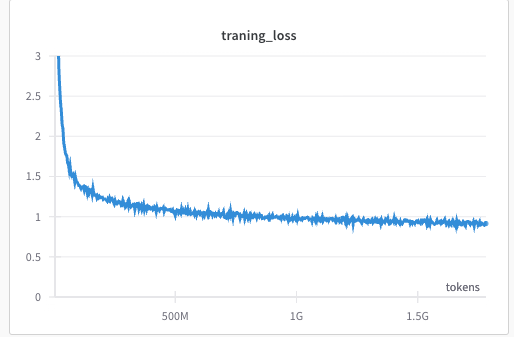

# Ohara

This is my collection of implimention of llm,paper and things I hand in my mind
I hand lot of fragmented code of implimention of diffrent model 

this is attempt to make it eveything in one place <br>
This lib is for runing/copying code for expriments
<br>
Install with [uv](https://docs.astral.sh/uv/):
```bash
git clone https://github.com/joey00072/ohara.git
cd ohara
uv sync
```

If `.venv` is a symlink to a shared environment, install without reconciling or removing its other
packages:

```bash
uv pip install --python .venv/bin/python -e .
```

Then run commands in the environment. `--no-sync` prevents changes to a shared `.venv`:

```bash
## download and pretokenize
uv run --no-sync python examples/prepare-dataset.py

## train 
## look at train.py its fairly easy
uv run --no-sync python examples/train_llama.py

# native ohara runtime wrapper (recommended)
uv run --no-sync python examples/train_llama_engine.py

# bounded TinyStories smoke run with held-out validation
uv run --no-sync python examples/train_llama_engine.py \
  --seq-len 128 --batch-size 32 --grad-accum-steps 1 \
  --max-iters 200 --eval-every 25 --eval-batches 8 --save-every 0

# resume model, optimizer, RNG, and streamed-data position (keep --num-workers 0)
uv run --no-sync python examples/train_llama_engine.py \
  --max-iters 20000 --checkpoint-path ./ckpt/model.pt --resume

# lighting fabric verison is also avalible
uv run --no-sync python examples/train_llama_fabric.py
```

## Scaling laws

Ohara includes a nanochat-style iso-FLOP workflow where model depth is the single size dial. Width,
attention heads, feed-forward size, parameter counts, FLOPs/token, global token batch, gradient
accumulation, learning rates, weight decay, and training horizon are derived consistently. Scaling
runs use untied embeddings, nanochat's width-transferable initialization, the hybrid Muon+AdamW
optimizer, per-group learning-rate transfer, Muon momentum warmup/warmdown, and cosine cautious
weight-decay decay.

Inspect a sweep before spending compute:

```bash
uv run --no-sync python examples/scaling_laws.py plan \
  --depths 10,12,14,16,18,20 \
  --flops-budgets 1e18,2.15e18,4.64e18,1e19 \
  --nproc-per-node 8
```

Run the sweep on TinyStories. Completed `(FLOPs, depth)` pairs in `results.csv` are skipped when the
command is restarted. Use a fresh results directory when changing the optimizer recipe, tokenizer,
dataset, or model grid; the runner refuses to mix older AdamW pilot rows into a Muon sweep.

```bash
# Recommended: stage the corpus once so GPU jobs never wait on the network.
uv run --no-sync python examples/prepare_scaling_data.py \
  --train-documents 100000 --validation-documents 10000 \
  --output-dir ./data/scaling_corpus

uv run --no-sync python examples/scaling_laws.py run \
  --depths 10,12,14,16,18,20 \
  --flops-budgets 1e18,2.15e18,4.64e18,1e19 \
  --nproc-per-node 8 \
  --dataset ./data/scaling_corpus \
  --tokenizer-local-files-only \
  --results-dir ./scaling_results
```

`--tokenizer-local-files-only` assumes that tokenizer has already been downloaded once. The sweep
also caches its token-to-byte table atomically inside the results directory, so restarted and
multi-run jobs do not repeatedly decode the full vocabulary.

Fit the per-budget quadratic iso-FLOP curves and the optimal parameter/token power laws:

```bash
uv run --no-sync python examples/scaling_laws.py analyze \
  --results-file ./scaling_results/results.csv \
  --output-json ./scaling_results/analysis.json \
  --output-svg ./scaling_results/scaling_laws.svg
```

The sweep records true bits per byte (`val_bpb`) using tokenizer byte lengths. This is distinct from
bits per token and remains comparable if the tokenizer vocabulary changes. At least three completed
depths per FLOP budget are required to fit an iso-FLOP curve. A power law is reported only when at
least two compute budgets have an interior fitted minimum; a boundary minimum means the depth grid
must be expanded before interpreting the exponent.



llama-20M trained on tinystores for 1.7B

inferance on phi2
```zsh
## this will download model from hf and run it in torch.flaot16

uv run --no-sync python phi_inference.py

## look at files and you can impliment rest of things easily, 
## I belive in you 😉
```


###  The lib to maximize FAFO
papaers and theory is on one side but `code is truth`, in the end things that matter that works (runs)<br>
If you look into [docs](./docs/) you can find some written things. this are mostly copied from my obsidian notes


### WORK IS PROGESS (always)

### papers / models
- [TokenFormer](./experiments/tokenformer/pattention.py)
- [MLA](./experiments/mla/mla.py)
- [Griffin & Hawk](./experiments/griffin_and_hawk/griffin_and_hawk.py)
- [Galore](./experiments/galore/galore.py)
- [Qsparse](./experiments/qsparse/qsparse.py)
- [Bitnet](./experiments/bitnet/bitnet.py)
- [renet](./ohara/models/retnet.py)
- [Alibi Embeddings](./ohara/embeddings_pos/alibi.py) | [md](./ohara/embeddings_pos/alibi/alibi.md)
- [Rotary Embeddings](./ohara/embeddings_pos/rotatry.py) | [md](./docs/RoFormer.md) 
- [LoRA ](./ohara/adaptor/lora.py)
- [DoRA](./ohara/adaptor/dora.py) | [paper](https://arxiv.org/abs/2402.09353)
- [LLAMA](./ohara/llama/llama.py) | [md](./docs/llama/llama.md)
- [XPOS](./ohara/embeddings_pos/xpos.py)
- [Mamba](./ohara/models/mamba.py)
- [GPT](./ohara/models/gpt.py) | [md](./docs/gpt/gpt.md)


### More things are not in this repo
1. [TinyLora](https://github.com/joey00072/TinyLora)
2. [Neural Style Transfer in Pytorch](https://github.com/joey00072/Neural-Style-Transfer-in-Pytorch)


## TODO  (A lot)
- [ ] make infercer class better
- [ ] make training loop better (use lightning fabric maybe)
- [ ] Finetuning in structed way (I just rawdoag code when I need it)
- [ ] DPO 
- [ ] make is py modele so I can create expriment folder and put all this in it

## Fund My Caffeine Addiction 
[](https://ko-fi.com/R6R8KQTZ5)


### contribution guidelines
- be nice, 
- code explaintions || docs are appricated
- memes on pr recommend
