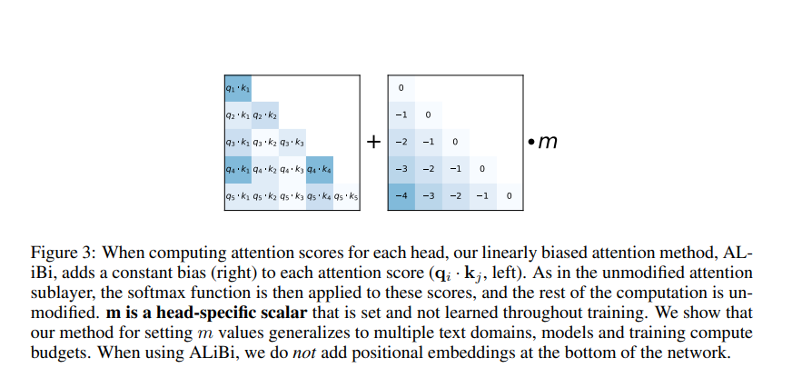

# ALiBi

Implementation: [alibi.py](../../../ohara/embeddings_pos/alibi.py).

ALiBi adds a distance penalty to attention scores. In causal attention, head `h`
adds `-m_h * (query_position - key_position)` for visible keys. Each head has a
different slope, so heads penalize distant tokens at different rates.

Ohara uses this slope schedule:

```python
slopes = 2 ** (-8 * torch.arange(1, num_heads + 1) / num_heads)
```

The schedule depends on the number of heads, not sequence length.


