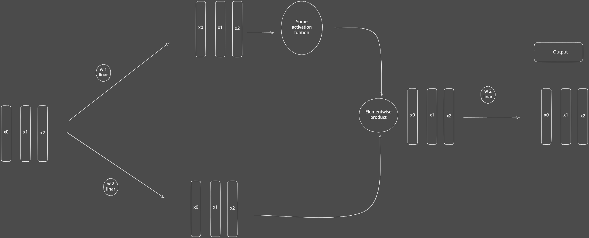
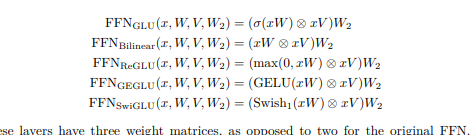

# Gated feed-forward layers

Paper: [GLU Variants Improve Transformer](https://arxiv.org/abs/2002.05202).
Implementation: [mlp.py](../../../ohara/modules/mlp.py).

Project the input twice, apply an activation to one projection, multiply the
results elementwise, then project back to the model width:

```text
hidden = activation(gate(x)) * up(x)
output = down(hidden)
```

`gate` and `up` map model width to hidden width; `down` maps hidden width back
to model width. SwiGLU uses SiLU as the gate activation; GEGLU uses GELU.




