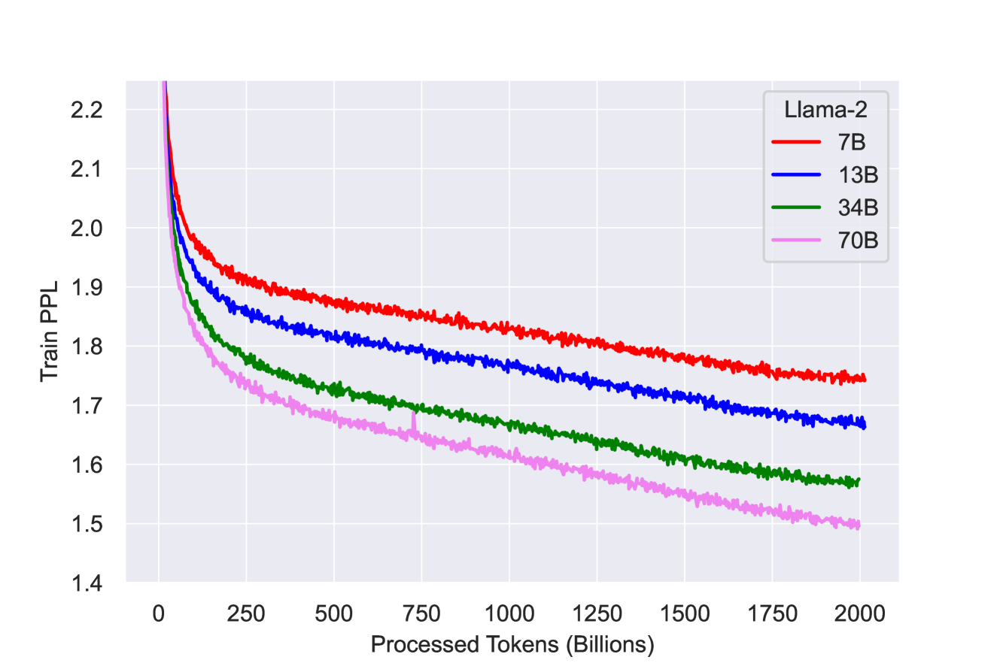

# Llama

Meta's decoder language model family:

- [Llama 1 paper](https://arxiv.org/abs/2302.13971)
- [Llama 2 paper](https://arxiv.org/abs/2307.09288)
- [Ohara implementation](../../../ohara/models/llama.py)

