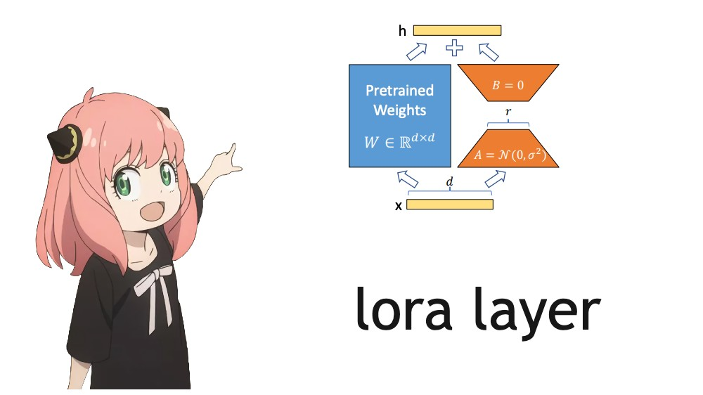

## LoRA: Low-Rank Adaptation of Large Language Models

paper: https://arxiv.org/pdf/2106.09685.pdf

## TLDR
geadient update is low rank. So we can decompose dW into A,B where A(mxr)and B(rxm).
dW = A@B
 
- so take transformer
- freeze weigths 
- modify linear layer xW to xW+ xAB 
- train 
- W new = W+ A@B