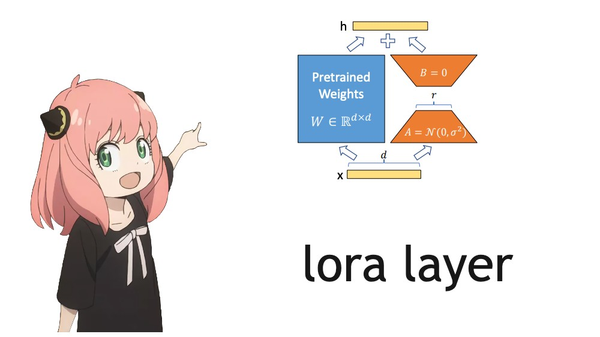

# LoRA

Paper: [Low-Rank Adaptation of Large Language Models](https://arxiv.org/abs/2106.09685).
Implementation: [lora.py](../../../ohara/adaptor/lora.py).

Freeze the pretrained weight and train a low-rank update. With PyTorch's
`W` shape `(out_features, in_features)`, the adapter uses:

```text
A: (rank, in_features)
B: (out_features, rank)
delta_W = (alpha / rank) * B @ A
```

The forward pass adds the adapter output to the original linear output.
At inference, `merge()` adds `delta_W` to the base weight.


