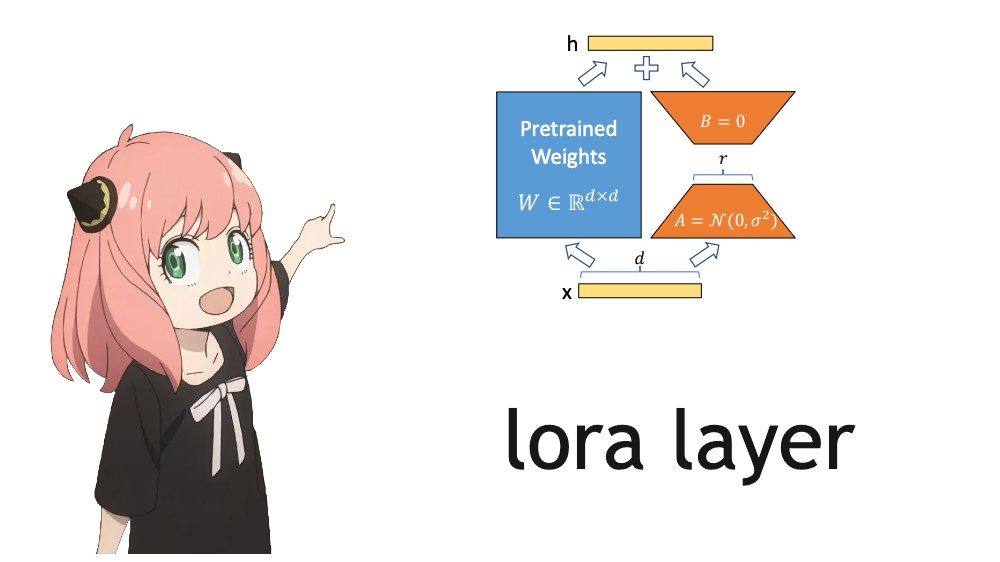

# LoRA

Paper: [Low-Rank Adaptation of Large Language Models](https://arxiv.org/abs/2106.09685).
Implementation: [lora.py](../../../ohara/adaptor/lora.py).

Freeze the pretrained weight and train a low-rank update. With PyTorch's
`W` shape `(out_features, in_features)`, the adapter uses:

```text
A: (rank, in_features)
B: (out_features, rank)
delta_W = (alpha / rank) * B @ A
```

The forward pass adds the adapter output to the original linear output.
At inference, `merge()` adds `delta_W` to the base weight.

```python
from ohara.adaptor.lora import replace_with_lora, mark_lora_as_trainable, merge_lora

model = replace_with_lora(model, target_layer=["query", "value"], rank=16)
mark_lora_as_trainable(model)
# Build the optimizer from trainable parameters, then fine-tune.
model.eval()
merge_lora(model)
```

Target names match linear layer names. Replacement preserves their weights,
biases, device, and dtype. Checkpoints save merge status with the weights so
reloading does not apply the update twice. Legacy checkpoints without merge
status are treated as unmerged.


