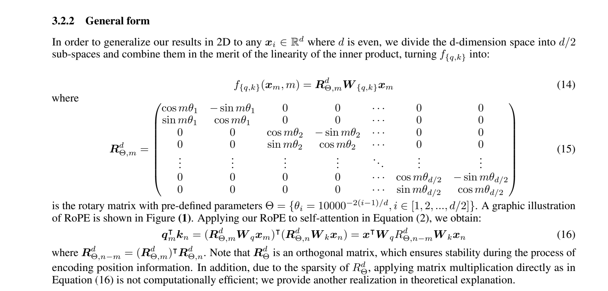

# Rotary position embeddings

Paper: [RoFormer](https://arxiv.org/abs/2104.09864).
Implementation: [rotary.py](../../../ohara/embeddings_pos/rotary.py).

RoPE rotates pairs of query and key features by a position-dependent angle.
For a pair `(a, b)` and angle `t`:

```text
a_rot = a * cos(t) - b * sin(t)
b_rot = a * sin(t) + b * cos(t)
```

Different pairs use different frequencies. The relative rotation between query
and key positions encodes their separation in the attention dot product.

For even head dimension `d`, pair `i` uses frequency `theta ** (-2 * i / d)`.
The angle is position times frequency. `precompute_freqs_cis` caches the cosine
and sine tables; `apply_rope` applies them to query/key tensors shaped
`(batch, sequence, heads, head_dim)`.


