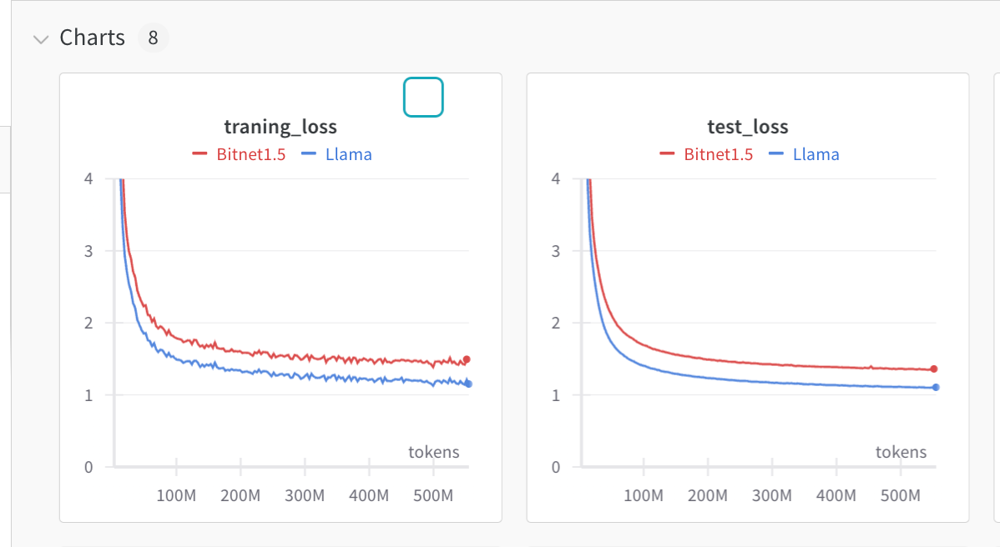
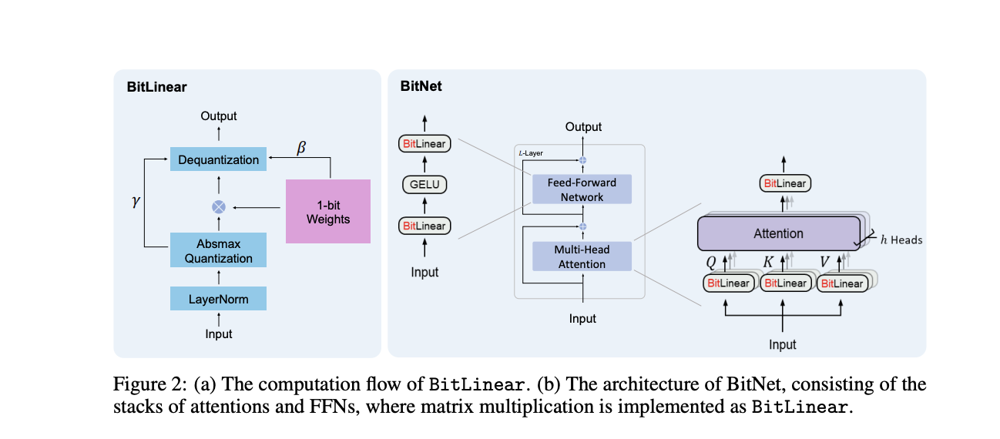
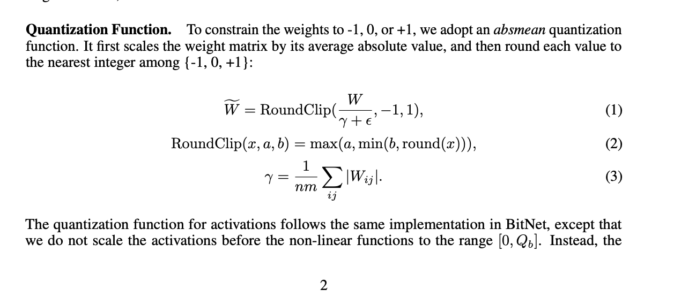
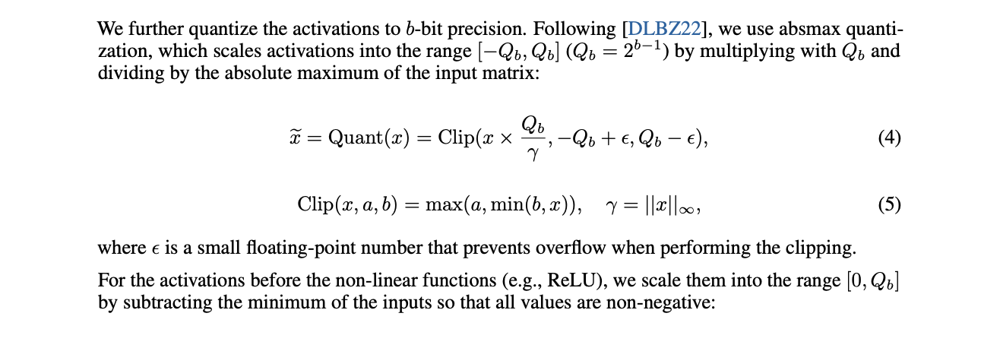

# Experiments with Bitnet 1.5 (ngmi)

Paper: [arxiv.org/abs/2402.17764](arxiv.org/abs/2402.17764)


(ever wondered why they didn't show the loss curve in the paper)

### It kind of works but Don't Get Hyped Up
This is one more of quantized-aware training rather than something radically new. There is room for kernel fusion and CUDA magic optimization because the hypothesis is storing weight matrix contain only 1,0,-1 that means we only need ADD,SUB operation which are better than expensive MUL. While at inference type we can achieve crazy speed up I am not sure that can be done at training time. Because we need smooth changes in optimizer gradient momentum.


For questions or corrections, reach me at [twitter/x](https://twitter.com/shxf0072) or `00shxf@gmail.com`. I build code amidst chaos, so if you find something to correct, let me know.

Here is the [code](https://github.com/joey00072/ohara/tree/master/experiments/bitnet) if you are just interested in it.

## Implementation Details
This is a Bitnet implementation based on the officially shared [PDF](https://github.com/microsoft/unilm/blob/master/bitnet/The-Era-of-1-bit-LLMs__Training_Tips_Code_FAQ.pdf) by the authors.


### Weight Quantization
Note for the current experiment all weights are stored in fp32/16 and quantized in the forward process.

Here $\gamma$ = scale and $\widetilde{W}$ = w_quant
```python
from torch import Tensor

def weight_quant(w: Tensor) -> tuple[Tensor, Tensor]:
    scale: Tensor = 1.0 / w.abs().mean().clamp(min=1e-5)
    quant: Tensor = (w * scale).round().clamp(-1, 1) / scale
    w_quant: Tensor = w + (quant - w).detach()
    scale = abs(w_quant).max().detach()
    w_quant = w_quant / scale
    return w_quant, scale 

```

w_quant is matrices of 1,0,-1 

### Activation Quantization
This is from a precursor paper https://arxiv.org/pdf/2310.11453.pdf

```python
from torch import Tensor

def activation_quant(x: Tensor) -> Tensor:
    scale: Tensor = 127.0 / x.abs().max(dim=1, keepdim=True).values.clamp(min=1e-5)
    y: Tensor = (x * scale).round().clamp(-128, 127) / scale
    return x + (y - x).detach()
```

### BitLinear
Now these two functions implement BitLinear; this layer is a drop-in replacement for nn.Linear. There is a lot of room for optimization with kernel fusion, manually writing backward pass, etc.

```python
import torch
import torch.nn as nn

class BitLinear(nn.Linear):
    def __init__(self, *args, **kwargs):
        super(BitLinear, self).__init__(*args, **kwargs)
        self.rms_norm = RMSNorm(self.in_features)

    def forward(self, x: Tensor) -> Tensor:
        w = self.weight
        x_norm = self.rms_norm(x)

        x_quant = activation_quant(x_norm)
        w_quant, scale = weight_quant(w)

        output = nn.functional.linear(x_quant, w_quant)
        return output * scale
```


### Training code

You can find my PyTorch implementation 
here https://github.com/joey00072/ohara/tree/master/experiments/bitnet.

I trained it with 15.5M llama and 15.6M bitnet llama (bitnet RMSNorm extra 0.1M). You can check the loss curve; bitnet is worse than llama (and I am pretty sure 2-bit quantization-aware training will be better or the same). 

Right now, BitNet is pretty useless for inference on current hardware; it's much better to train the model in bfloat16 and use the quantized version if you need it. To achieve a significant speed-up, 

the prerequisites for BitNet 1.5 are substantial.
We need someone to create a special chip that supports mixed precision with 2-bit. So, the big assumption is we will use a 2-bit model for inference, meaning someone will have to spend a lot (a lot) of money to build the chip, software, and train quantization-aware LLM. Not to mention the fact that we don't know if scaling laws hold the same for 1.5bit (it's 2 bit) quantization training as they do for normal. Unless someone is ready to spend a ton of money.

so, BITNET NGMI

---
[](https://ko-fi.com/R6R8KQTZ5)
