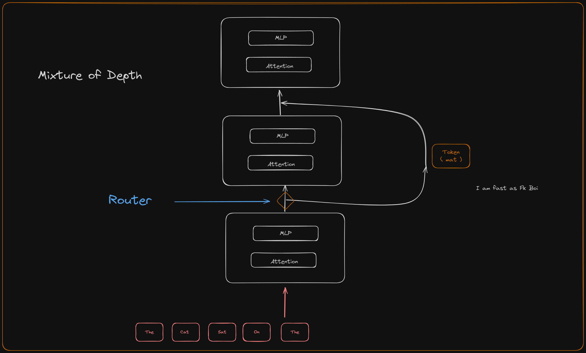
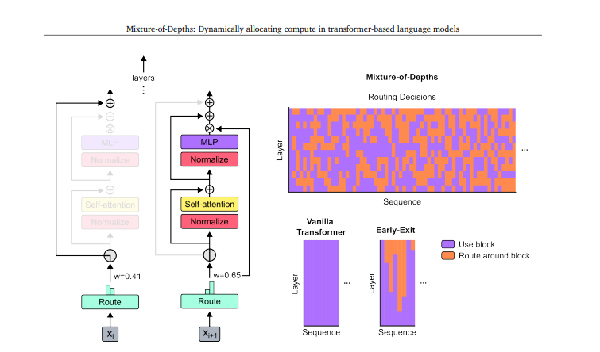
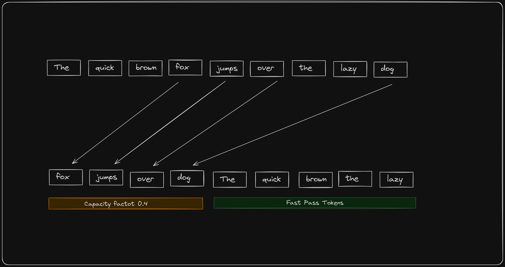
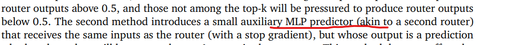
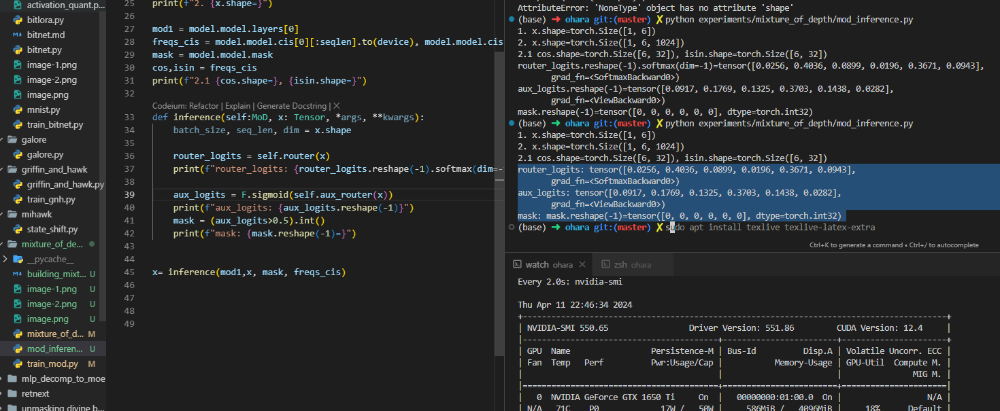
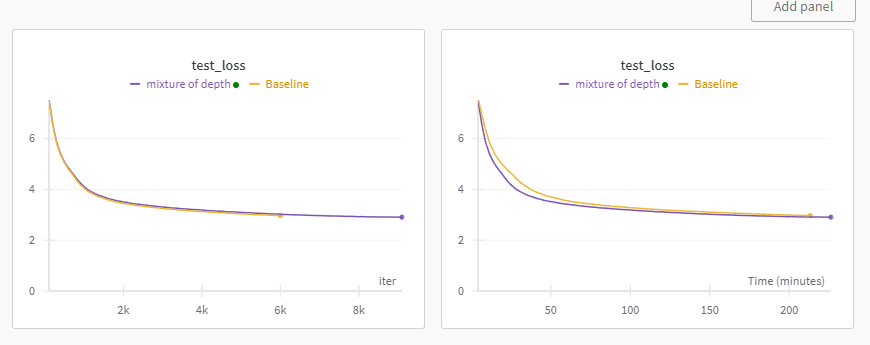

# Mixture of Depth is Vibe



This is a short dev blog on mixture of depth (MoD). This will have a short explanation of the paper, code, and some thoughts. This blog assumes you know mixture of experts. 

paper: [arxiv.org/abs/2404.02258](arxiv.org/abs/2404.02258)

If you are just interested in code it's here LINK,<br>
the blog is also available on pythonstuff (mysite). <br>
for any questions, comments, and corrections reach me at twitter [@shxf0072](https://twitter.com/shxf0072) or `00shxf@gmail.com`

### The problem
Modern language models are built on transformer blocks, we stack n X blocks to build huge models. A token passes through these big models and predicts the next token. Now the problem is for each token we spend the same amount of compute.
The mod is two small text completions `3+17 = 20` and `3*17 = 51`. Both have the same amount of tokens but predicting addition is way simpler than predicting multiplication. But if we take transformers we spend the same amount of compute regardless of the complexity of the problem. Another example would be if you are playing a game with your friends, some casual conversation would be like `you should buy the rifle` or `you are a ducking noob` in both sentences last words take different amounts of brain cycles, for the first one you will think or for the second you'll probably not. In the same way, we want a different amount of compute to be spent on some words than others.

### Mixture of depth (MoD)


Mixture of depth tries to solve this problem by adding a simple router in transformers. This router will decide if the token should go through this block (think) or skip the block by passing around it. 

### Alright this is easy why people didn't think of it before
They did a lot, the problem is for training we use batches of samples. if we decide some token will go through the block and some will not this changes the shape of the input array dynamically, which makes training slow or impossible in some cases


### Capacity Based Routing


In this paper, they adopt a strategy of capacity-based routing, The capacity is something that we define, Suppose we have a seq of length L=100 and we set capacity factor 0.12 then only 12 tokens will pass through Block(attn+mlp) and the rest will directly go to the next block.<br>

This capacity method is taken from [Mixture-of-Experts with Expert Choice Routing](https://arxiv.org/pdf/2202.09368.pdf). If there is an expert of set capacity and it will take only that much amount of tokens. here we do the same thing but vertically. we set each block capacity if some percent of max seq length and only that much amount of tokens. This has added benefit where how you will split the input array is statically defined and defining shape ahead of time make gpu go burr.


### Implementation details
I have annotated code, I am not gonna write more words to explain something again. you should read the code. `you should always read the code `
```python

class MoD(nn.Module):
    """
    Paper: https://arxiv.org/abs/2404.02258
    """

    def __init__(self, cfg: Config) -> None:
        super().__init__()
        self.seq_len = cfg.seq_len
        self.capacity_factor = cfg.capacity_factor
        self.dim = cfg.d_model

        self.transformer_decoder_block = Block(cfg)
        self.router = nn.Linear(self.dim, 1, bias=False)
        self.aux_router = nn.Sequential(
                            nn.Linear(self.dim,self.dim//2),
                            nn.SiLU(),
                            nn.Linear(self.dim//2,1),
                            )

    def forward(
        self, x: Tensor, mask, freqs_cis, mode="train", auxiliary_loss=False, *args, **kwargs
    ):
        batch_size, seq_len, dim = x.shape

        if mode == "inference":
            return self.inference(x, *args, **kwargs)
        # S = seq_len, C = capacity  , C = int(seq_length * capacity_factor)
        #  page 6 above eq 1 | ( C<S ) | here top_k = beta
        top_k = int(seq_len * self.capacity_factor)  

        # eq1 page 6
        # scaler weights for each token
        router_logits = self.router(x)  # (x) batch,seq_len,dim -> r batch,seq_len,1

        #  𝑟𝑙> 𝑃𝛽 (R)  ... eqution 1
        token_weights, token_index = torch.topk(router_logits, top_k, dim=1, sorted=False)

        # now we have idx, we can copy this weights to another tensor and pass them to attn+mlp

        # since its auto regressive model we need to keep casual nature of it
        # that why we need sort the tokens by idx before we pass it to attn
        selected_tokens, index = torch.sort(token_index, dim=1)

        # select idx for copying for original tensor
        indices_expanded = selected_tokens.expand(-1, -1, dim)

        # This are fillted topk tokens with capactiy C
        filtered_x = torch.gather(input=x, dim=1, index=indices_expanded)  # -> batch, capacity, dim

        x_out, _ = self.transformer_decoder_block(filtered_x, mask, freqs_cis)

        # softmax router weights, aaah
        token_weights = F.softmax(token_weights, dim=1) 

        # selecting router wight by idx ( in sorted maner)
        r_weights = torch.gather(token_weights, dim=1, index=index)

        # muliply by router weights, this add router in gradient stream
        xw_out = r_weights * x_out

        # batch_indices = torch.arange(batch_size).unsqueeze(-1).expand(-1, top_k)
        # # # https://discuss.pytorch.org/t/when-inplace-operation-are-allowed-and-when-not/169583/2
        # out = x.clone()
        # # add back to resuidal strean
        # out[batch_indices, selected_tokens.squeeze(-1),: ] += xw_out
        # # ^ this can be done with torch.scatter_add
        out = torch.scatter_add(input=x, dim=1, index=indices_expanded, src=xw_out)

        if auxiliary_loss:
            aux_loss = self.aux_loss(   , router_logits, selected_tokens)
            return out, aux_loss
        return out, _

    def aux_loss(self, x: Tensor, router_logits: Tensor, selected_tokens: Tensor):
        batch_size, seq_len, dim = x.shape
        # Page 7, Section 3.5 sampling
        router_targets = torch.zeros_like(router_logits).view(
            -1
        )  # i think torch to scatter will work here TODO
        router_targets[selected_tokens.view(-1)] = 1.0
        aux_router_logits = self.aux_router(x.detach().view(batch_size * seq_len, -1))
        # aux_router_logits = F.sigmoid(aux_router_logits)  # keep output in range [0,1)
        # RuntimeError: torch.nn.functional.binary_cross_entropy and torch.nn.BCELoss are unsafe to autocast.
        # so binary_cross_entropy_with_logits == sigmoid + bce_loss
        return F.binary_cross_entropy_with_logits(aux_router_logits.view(-1), router_targets)

```      

One more thing We use alterative block of [MOD,Block,MOD...], in layers mod only dosnt work that well.
## Softmax, Causality, and Auxiliary Yapping

Now you may have noticed we are using Softmax over the whole sequence length. This breaks causality, meaning future tokens are affecting past tokens. Is this wrong? Yes. Do we fix it? NO. It works just because.

The paper suggests adding another router that will predict if a token gets selected or not.

Initially, I thought the additional router was a simple linear router, but IT'S NOT. I trained a model with a linear router and wrote inference code for it, and it was yapping, working but yapping. There is no information about this second router, like how many layers it has, which activation it uses, what do you qualify as small, what's the hidden dimension? That's for the reader to guess 😒. 


I thought I would train another model, but I didn't. So instead of this being yet another thing I left here in this blog without inference code. I will update this if I train it, though.

By the way, if we replace softmax with sigmoid for the main router, the model still works and doesn't break causality. I have ideas for improvement of this but will work on it when I find time.

### Loss Curves



Mod is a superior way to train models. For seq_len 512, model_size 300M, mod is 30% faster than the baseline while achieving lower loss (capacity factor 0.12). lot of the speedup came from attention computation. Since attention is quadratic, for full attn we need an n^2 matrix while mod with capacity factor 0.12 is 0.0144. The saving can be calculated by n^2 - (0.12n)^2 = n^2 - 0.0144n^2 = n^2(0.9856) so saving grows quadratically also compared to the baseline.

### Few Gotchas
- With mod, you can't do batch inference since each token, since each token in a different batch can get routed around the block. You can if you use a mask but at that point, it's the same as having inference on a normal model with the overhead of a router.
- Putting the whole seq will not have a lot of speed up, the same problem above some token will go through blocks some will not, and at inference time we don't want fixed capacity routing.
- Existing speedup techniques of speculative decoding will not work or not be useful as they are in normal models.

Overall it's a solid architecture, even if we do inference as a normal model training speedups alone make this worth it. Good job Google thanks for making knowledge "Open" (cough),

---
[](https://ko-fi.com/R6R8KQTZ5)

